# ITA Wiki Frontend

The ITA Wiki Frontend is a React-based web application that serves as a knowledge-sharing platform for IT Academy students and professionals. It allows users to discover, create, and interact with educational resources related to programming and technology.

## Purpose and Key Features

The ITA Wiki Frontend provides the following core functionality:

- **Resource Management**: Browse, filter, create, and interact with learning resources
- **GitHub Authentication**: Sign in with GitHub credentials
- **Role-Based Access Control**: Different permissions based on user roles
- **Social Features**: Bookmark and like resources
- **Category and Tag System**: Organized content discovery

## System Architecture

The application follows a component-based architecture built with React, using context API for state management and Firebase for authentication.

## Core Data Flow

The application manages several key data types that flow through the system:

## Component Hierarchy

The component structure follows a hierarchical pattern, with the main application container wrapping various feature components:

## State Management

The application uses React Context for state management. There are three main contexts:

| Context          | Purpose                      | Main State                               |
| ---------------- | ---------------------------- | ---------------------------------------- |
| UserContext      | Manages authentication state | Current user, login status, role         |
| ResourcesContext | Manages resource data        | Resource list, bookmarks, loading states |
| LikesContext     | Manages user likes           | Liked resources, like counts             |

## Authentication Flow

The application uses GitHub for authentication:

## API Integration

The application communicates with the backend through a set of configured endpoints:

| API Endpoint | Purpose                      |
| ------------ | ---------------------------- |
| resources/   | Manage educational resources |
| bookmarks/   | Handle user bookmarks        |
| likes/       | Handle user likes            |
| tags/        | Manage resource tags         |
| roles/       | Manage user roles            |

## Resource Management

The ResourcesContext is the central state manager for resources:

## Resource Type System

The application handles various types of resources, categorized by field and type:

| Resource Property | Description        | Examples                   |
| ----------------- | ------------------ | -------------------------- |
| Category          | Subject area       | React, JavaScript, Node.js |
| Theme             | UI framework/theme | Null or specific theme     |
| Type              | Content type       | Tutorial, Article, Video   |
| Tags              | Custom labels      | Array of tag objects       |
